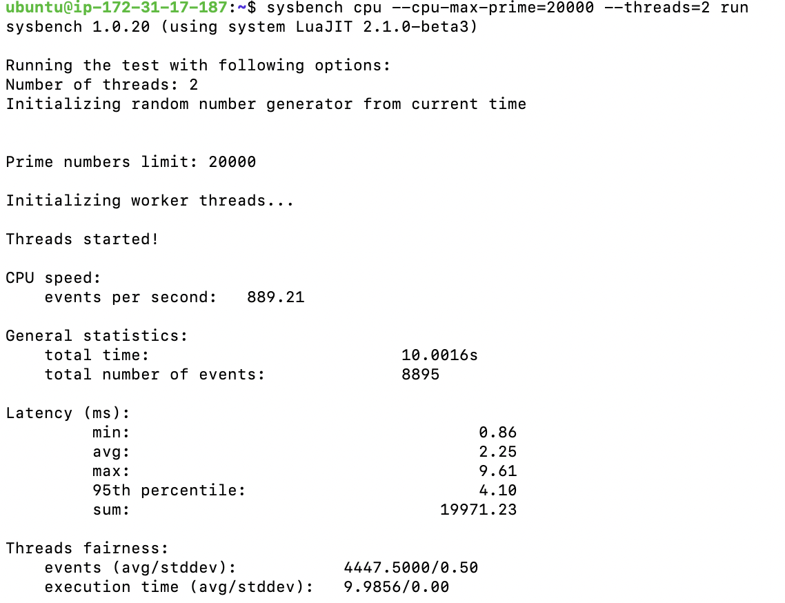
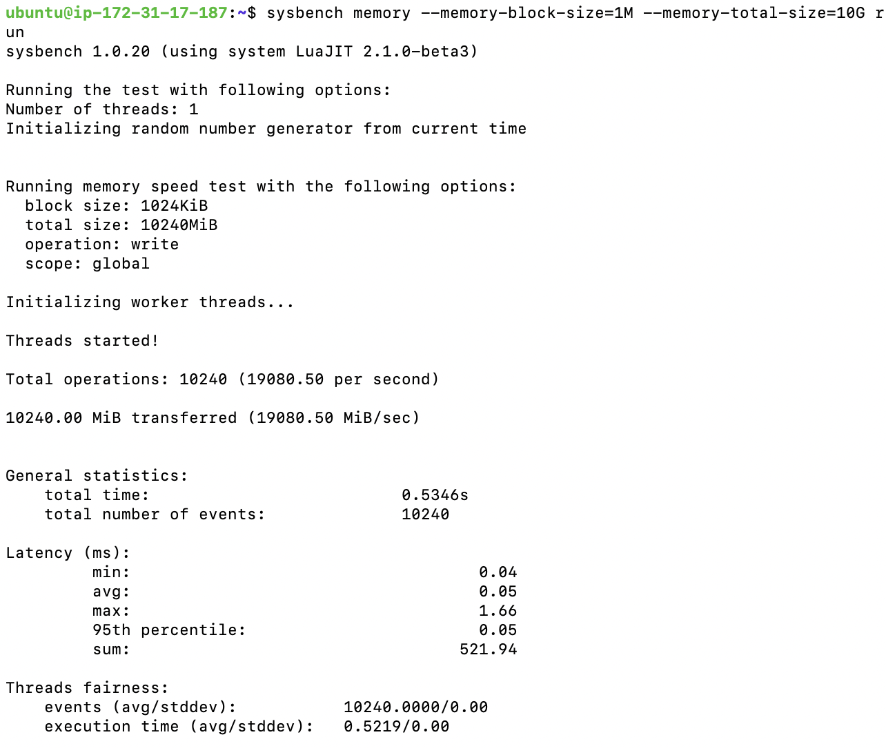

[](https://classroom.github.com/a/IAASVEAZ)
# CSIT5970 Assignment-1: EC2 Measurement (2 questions, 4 marks)

### Deadline: 11:59PM, Feb, 28, Friday

---

### Name: Yang Keyun
### Student Id: 21071571
### Email: kyangba@connect.ust.hk

---

## Question 1: Measure the EC2 CPU and Memory performance

1. (1 mark) Report the name of measurement tool used in your measurements (you are free to choose *any* open source measurement software as long as it can measure CPU and memory performance). Please describe your configuration of the measurement tool, and explain why you set such a value for each parameter. Explain what the values obtained from measurement results represent (e.g., the value of your measurement result can be the execution time for a scientific computing task, a score given by the measurement tools or something else).

    > Your answer goes here.

    I used measurement tool called **sysbench**.

    Configuration and Parameter Explanation:

    1. **CPU Test:**

       ```shell
       sysbench cpu --cpu-max-prime=20000 --threads=2 run
       ```

       This command instructs the CPU to complete as many prime calculations as possible within 10 seconds. It then records the total number of tasks (events) completed, the number of events processed per second, and metrics such as the average, minimum, and maximum time taken for each event.

       `--cpu-max-prime=20000`: Tests the calculation of prime numbers up to 20,000. A higher value increases the test load.

       `--threads=2`: Sets the number of threads to 2, simulating multi-core computation.

       **Result:** 

       - CPU speed: The system processed **889.21 events per second**, indicating the rate of prime number calculations.
       - Total number of event: The test completed with a total of **8,895 events** processed.
       - Latency: Minimum execute time per event is **0.86ms**, avg execute time is **2.25ms**, max execute time is **9.61ms**

       

    2. Memory Test:

       ```shell
       sysbench memory --memory-block-size=1M --memory-total-size=10G run
       ```

       `--memory-block-size=1M`: Specifies the size of each read/write block.

       `--memory-total-size=10G`: Defines the total amount of data to be read/written, ensuring a thorough test of memory bandwidth and latency.

       

       Total operations: 10,240 operations were performed at a rate of **19,080.50 operations per second**.

       Data transfer rate: A total of **10,240 MiB** was transferred, achieving a memory bandwidth of **19,080.50 MiB/sec**.

       Execution time: The test completed in **0.5346 seconds**.

2. (1 mark) Run your measurement tool on general purpose `t2.micro`, `t2.medium`, and `c5d.large` Linux instances, respectively, and find the performance differences among these instances. Launch all the instances in the **US East (N. Virginia)** region. Does the performance of EC2 instances increase commensurate with the increase of the number of vCPUs and memory resource?

    In order to answer this question, you need to complete the following table by filling out blanks with the measurement results corresponding to each instance type.

    | Size        | CPU performance | Memory performance |
    | ----------- | --------------- | ------------------ |
    | `t2.micro` | Total number of events: 8895<br />Cpu speed: 889.2events/second<br />Max Latency: 9.61ms<br />Min Latency: 0.86ms<br />Avg Latency: 2.25ms | Execution time: 0.5346s<br />Bandwidth: 19080.5MiB/sec<br />Max Latency: 1.66ms<br />Min Latency: 0.04ms<br />Avg Latency: 0.05ms |
    | `t2.medium`  | Total number of events: 16199<br />Cpu speed: 1619.44events/second<br />Maximum Latency: 8.25ms<br />Minimum Latency: 0.86ms<br />Avg Latency: 1.23ms | Execution time: 0.5360s<br />Bandwidth: 19027.36MiB/sec<br />Max Latency: 2.29ms<br />Min Latency: 0.04ms<br />Avg Latency: 0.05ms |
    | `c5d.large` | Total number of events: 7024<br />Cpu speed: 702.14events/second<br />Maximum Latency: 5.29ms<br />Minimum Latency: 2.81ms<br />Avg Latency: 2.85ms | Execution time: 0.5212s<br />Bandwidth: 19586.18MiB/sec<br />Max Latency: 0.12ms<br />Min Latency: 0.05ms<br />Avg Latency: 0.05ms |

    From the table we can find that, the performance of EC2 instances does not increase strictly in proportion to the number of vCPUs and memory resources.
    
    From the results:
    
    - **CPU Performance:**
      - When moving from **t2.micro (1 vCPU)** to **t2.medium (2 vCPUs)**, the CPU speed nearly doubles (889.2 → 1619.44 events/second), which shows a proportional increase.
      - However, when moving to **c5d.large (2 vCPUs)**, the CPU performance is unexpectedly lower (**702.14 events/second**) despite having the same number of vCPUs. This could be due to differences in CPU architecture, burst capabilities, or resource allocation policies.
    - **Memory Performance:**
      - The memory bandwidth across all three instances is very similar (**around 19,000 MiB/sec**), indicating that memory performance does not significantly improve with the increase in vCPUs or memory size.
    - It can also be observed that the **c5d.large** instance generally exhibits more stable **CPU and memory read/write latency** compared to the **t2 series**. The difference between the **minimum and maximum latency** is not as large, indicating more consistent performance.
    
    > Region: US East (N. Virginia). Use `Ubuntu Server 22.04 LTS (HVM)` as AMI.

## Question 2: Measure the EC2 Network performance

1. (1 mark) The metrics of network performance include **TCP bandwidth** and **round-trip time (RTT)**. Within the same region, what network performance is experienced between instances of the same type and different types? In order to answer this question, you need to complete the following table.

    | Type                      | TCP b/w (Mbps) | RTT (ms) |
    | ------------------------- | -------------- | -------- |
    | `t3.medium` - `t3.medium` | 4160           | 0.310    |
    | `m5.large` - `m5.large`   | 4950           | 0.129    |
    | `c5n.large` - `c5n.large` | 9490           | 0.104    |
    | `t3.medium` - `c5n.large` | 4650           | 0.733    |
    | `m5.large` - `c5n.large`  | 4960           | 0.434    |
    | `m5.large` - `t3.medium`  | 4680           | 0.978    |

    From the table, we can find that the **TCP bandwidth** between EC2 instances does not increase strictly in proportion to the instance type or size. However, When different instance types are connected, **RTT** generally worsen compared to same-type connections.

    > Region: US East (N. Virginia). Use `Ubuntu Server 22.04 LTS (HVM)` as AMI. Note: Use private IP address when using iPerf within the same region. You'll need iPerf for measuring TCP bandwidth and Ping for measuring Round-Trip time.

2. (1 mark) What about the network performance for instances deployed in different regions? In order to answer this question, you need to complete the following table.

    | Connection                | TCP b/w (Mbps) | RTT (ms) |
    | ------------------------- | -------------- | -------- |
    | N. Virginia - Oregon      | 461            | 63.077   |
    | N. Virginia - N. Virginia | 4750           | 0.323    |
    | Oregon - Oregon           | 4380           | 0.193    |

    According to the table, the **network performance varies significantly** depending on whether instances are deployed within the same region or across different regions.
    
    > Region: US East (N. Virginia), US West (Oregon). Use `Ubuntu Server 22.04 LTS (HVM)` as AMI. All instances are `c5.large`. Note: Use public IP address when using iPerf within the same region.
